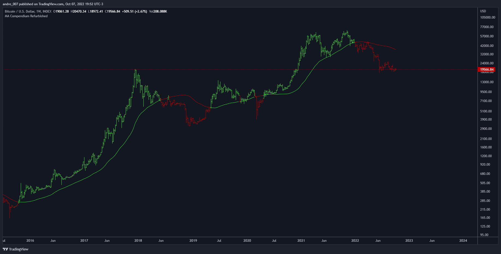

# Moving Average Compendium Refurbished

This is my effort to bring together in a single script the widest range of moving averages possible.
I aggregated the calculation of averages within a library.

For more information about the library follow the link:

[Moving Averages Proxy](https://github.com/andreperez/Moving-Averages-Proxy)

Basically this indicator is the visual result of this library.

You can choose the moving average and the script updates the chart as per the type.

The unique parameters of certain moving averages remain at their default values.

To have a rainbow of moving averages I also made an indicator:

[Moving Averages Refurbished](https://github.com/andreperez/Moving-Averages-Refurbished)

## Available moving averages:

- AARMA = 'Adaptive Autonomous Recursive Moving Average'
- ADEMA = 'Alpha-Decreasing Exponential Moving Average'
- AHMA = 'Ahrens Moving Average'
- ALMA = 'Arnaud Legoux Moving Average'
- ALSMA = 'Adaptive Least Squares'
- AUTOL = 'Auto-Line'
- CMA = 'Corrective Moving average'
- CORMA = 'Correlation Moving Average Price'
- COVWEMA = 'Coefficient of Variation Weighted Exponential Moving Average'
- COVWMA = 'Coefficient of Variation Weighted Moving Average'
- DEMA = 'Double Exponential Moving Average'
- DONCHIAN = 'Donchian Middle Channel'
- EDMA = 'Exponentially Deviating Moving Average'
- EDSMA = 'Ehlers Dynamic Smoothed Moving Average'
- EFRAMA = 'Ehlrs Modified Fractal Adaptive Moving Average'
- EHMA = 'Exponential Hull Moving Average'
- EMA = 'Exponential Moving Average'
- EPMA = 'End Point Moving Average'
- ETMA = 'Exponential Triangular Moving Average'
- EVWMA = 'Elastic Volume Weighted Moving Average'
- FAMA = 'Following Adaptive Moving Average'
- FIBOWMA = 'Fibonacci Weighted Moving Average'
- FISHLSMA = 'Fisher Least Squares Moving Average'
- FRAMA = 'Fractal Adaptive Moving Average'
- GMA = 'Geometric Moving Average'
- HKAMA = 'Hilbert based Kaufman\'s Adaptive Moving Average'
- HMA = 'Hull Moving Average'
- JURIK = 'Jurik Moving Average'
- KAMA = 'Kaufman\'s Adaptive Moving Average'
- LC_LSMA = '1LC-LSMA (1 line code lsma with 3 functions)'
- LEOMA = 'Leo Moving Average'
- LINWMA = 'Linear Weighted Moving Average'
- LSMA = 'Least Squares Moving Average'
- MAMA = 'MESA Adaptive Moving Average'
- MCMA = 'McNicholl Moving Average'
- MEDIAN = 'Median'
- REGMA = 'Regularized Exponential Moving Average'
- REMA = 'Range EMA'
- REPMA = 'Repulsion Moving Average'
- RMA = 'Relative Moving Average'
- RSIMA = 'RSI Moving average'
- RVWAP = 'Rolling VWAP'
- SMA = 'Simple Moving Average'
- SMMA = 'Smoothed Moving Average'
- SRWMA = 'Square Root Weighted Moving Average'
- SW_MA = 'Sine-Weighted Moving Average'
- SWMA = 'Symmetrically Weighted Moving Average'
- TEMA = 'Triple Exponential Moving Average'
- THMA = 'Triple Hull Moving Average'
- TREMA = 'Triangular Exponential Moving Average'
- TRSMA = 'Triangular Simple Moving Average'
- TT3 = 'Tillson T3'
- VAMA = 'Volatility Adjusted Moving Average'
- VIDYA = 'Variable Index Dynamic Average'
- VWAP = '* VWAP'
- VWMA = 'Volume-weighted Moving Average'
- WMA = 'Weighted Moving Average'
- WWMA = 'Welles Wilder Moving Average'
- XEMA = 'Optimized Exponential Moving Average'
- ZEMA = 'Zero-Lag Exponential Moving Average'
- ZSMA = 'Zero-Lag Simple Moving Average'

## Donations

- Bitcoin: 3AK6MxX93czQraP4AFv1wKYDvPnPipgF51
- Dash: XuSnX2YgsGVcfKY24TtndBu5X7tZShPTC7
- LiteCoin: MQEmwEqLA3WUsuQ1E6u8wDxzUrDRotZyH8
